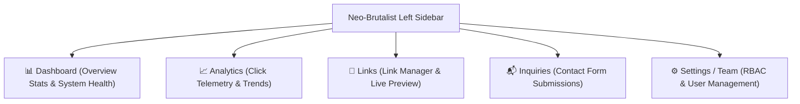

# AWS Student Builder Group (AWS SBG) — Admin Portal PRD (`PRD_ADMIN.md`)

**Application:** Dedicated Admin Management Console (`apps/admin` → `https://admin.awssbg.online`)  
**Design System:** Hardcore Neo-Brutalism (0px razor-sharp corners, 3px solid black ink borders, 4px hard drop shadows)  
**Target Audience:** AWS SBG Community Leaders, Student Organizers, System Administrators  
**Status:** Approved Specification  

---

## 1. Security & Architecture Isolation

- **Standalone Domain:** Deployed exclusively to `admin.awssbg.online`. Strictly NEVER linked from the public website (`awssbg.online`) navigation or footers.
- **Search Engine Blocking:** `robots.txt` strictly configured with `User-agent: *` and `Disallow: /` to prevent indexing of the admin interface.
- **Secret Zero Leak Policy:** The client bundle only contains `NEXT_PUBLIC_SUPABASE_ANON_KEY`. Administrative actions requiring elevated privileges (e.g. creating/deleting auth users) execute via Cloudflare Pages Functions (`/api/users`) using the server-side `SUPABASE_SERVICE_ROLE_KEY`.

---

## 2. Admin Layout & Navigation (Collapsible Left Sidebar)

The Admin Console utilizes a persistent, collapsible Neo-Brutalist Left Sidebar with desktop toggling and mobile drawer support.

### Sidebar Views & Routing:

| View | Key Capabilities |
| :--- | :--- |
| **1. Dashboard** | High-level metrics (Total Active Links, Unread Inquiries, Total Clicks, Total Admins), recent activity log, quick link creation button, and Supabase connection latency badge. |
| **2. Analytics** | Real-time link click volume, click-through rates (CTR) per link, platform breakdown (WhatsApp, Discord, AWS, Instagram, etc.), device distribution, and time-series click trend charts. |
| **3. Links** | Full CRUD link manager: create/edit/delete links, platform icon selection (17+ icons), drag/up-down sort ordering, instant active toggling, and an interactive live mobile preview frame. |
| **4. Inquiries** | Inbox for all contact form submissions from `awssbg.online/contact`. Badge count for unread messages, category filtering (*General*, *Study Jam*, *Speaker*, *Partnership*), message detail viewer, and status toggles (*Unread*, *Read*, *Replied*). |
| **5. Settings & Team** | Team user management: invite new admins via email, Super Admin vs Admin permissions, delete admin accounts via Cloudflare Edge API, live password strength meter, and session security. |

---

## 3. Detailed View Specifications

### A. Dashboard View
- **Metric Cards (Neo-Brutalist Stamps):**
  - `ACTIVE LINKS`: Total count of enabled links with green active indicator.
  - `UNREAD INQUIRIES`: Count of unread submissions from `/contact` with alert badge.
  - `TOTAL CLICK TRAFFIC`: Sum of all link clicks across the community hub.
  - `ADMIN TEAM`: Number of active administrators.
- **Quick Action Bar:**
  - `+ Add New Link` (opens creation modal).
  - `View Public Site` (opens `https://awssbg.online` in new tab).
  - `Review Inquiries` (switches to Inquiries tab).

### B. Analytics View
- **Click Telemetry Metrics:**
  - Aggregated from the `link_clicks` table and `links.click_count` counter column.
  - Top Performing Links table (Rank, Title, Platform Icon, Total Clicks, Share of Total Clicks).
  - Platform Distribution: Visual breakdown of clicks by channel (e.g. 45% WhatsApp, 30% Discord, 15% Instagram, 10% Direct).
- **Time-Series Visualization:**
  - Neo-Brutalist bar charts showing daily/weekly click volume.

### C. Links Management View
- **Link Table / List:**
  - Columns: Sort Order, Icon, Title, URL, Platform, Status Switch (`is_active`), Click Count, Actions (Move Up, Move Down, Edit, Delete).
- **Create / Edit Link Modal:**
  - Title (required, text)
  - URL (required, valid URL)
  - Platform (select: AWS, Skill Builder, Meetup, WhatsApp, Discord, LinkedIn, GitHub, YouTube, Instagram, X/Twitter, TikTok, Facebook, Telegram, Medium, Dev.to, Hashnode, Website)
  - Description (optional, max 100 characters)
- **Live Mobile Preview Simulator:**
  - Split-screen or toggleable preview frame simulating the 500px mobile landing page in real-time as changes are made.

### D. Inquiries View (Contact Form Management)
- **Inquiry Inbox:**
  - Displays all submissions sent by students and collaborators via `awssbg.online/contact`.
  - Columns/Cards: Submitter Name, Email Address, Category Stamp, Submission Date, Status Badge, Quick Actions.
- **Filter & Search:**
  - Filter by Category: All, General, Study Jam, Speaker/Workshop, Partnership.
  - Filter by Status: All, Unread, Read, Replied.
- **Inquiry Detail Drawer / Modal:**
  - Full message text.
  - One-click `mailto:` response trigger.
  - Action buttons: `Mark as Read`, `Mark as Replied`, `Delete Inquiry`.

### E. Settings & Team Management View
- **Admin User Management:**
  - User List: Email, Full Name, Role (`Super Admin` vs `Admin`), Last Sign-In, Creation Date.
  - Invite New Admin: Input email and select role. Dispatches onboarding email via Supabase Auth.
  - Delete Admin: Calls `/api/users` endpoint with JWT authentication to safely remove user from Supabase Auth and database.
- **Live Password Strength Meter:**
  - Visual 4-tier Neo-Brutalist bar meter: *VERY WEAK* → *WEAK* → *FAIR* → *STRONG* → *INVINCIBLE*.
  - Enforces length, mixed-case, numbers, and symbols before submission.
- **Security & Sign Out:**
  - Immediate session invalidation via `supabase.auth.signOut()`.
