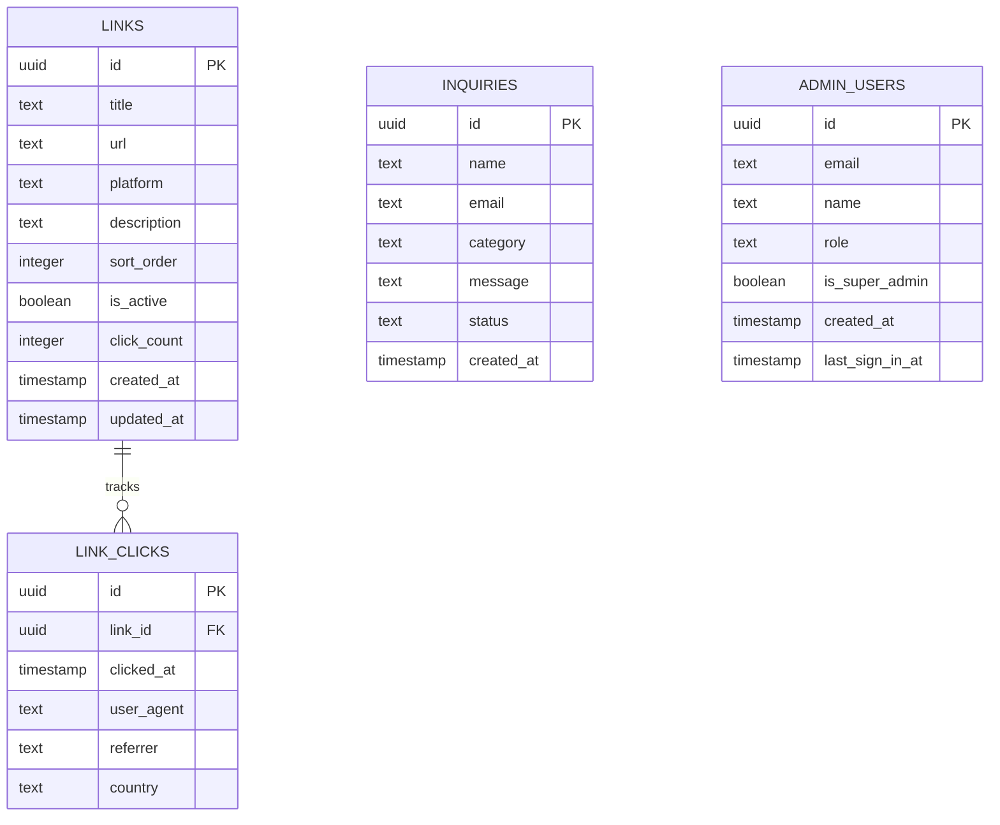

# AWS Student Builder Group (AWS SBG) — Backend & Database PRD (`PRD_BACKEND.md`)

**Architecture:** Supabase (PostgreSQL + Auth + Storage) + Cloudflare Pages Functions (Edge APIs) + Resend / Supabase Auth SMTP  
**Security Model:** Row Level Security (RLS) + JWT Verification + Edge Service Role Isolation  
**Status:** Approved Specification  

---

## 1. Database Schema (PostgreSQL / Supabase)



---

## 2. Table Definitions & SQL Specifications

### A. `links` Table
```sql
CREATE TABLE public.links (
    id UUID PRIMARY KEY DEFAULT gen_random_uuid(),
    title TEXT NOT NULL,
    url TEXT NOT NULL,
    platform TEXT NOT NULL DEFAULT 'website',
    description TEXT,
    sort_order INTEGER NOT NULL DEFAULT 0,
    is_active BOOLEAN NOT NULL DEFAULT true,
    click_count INTEGER NOT NULL DEFAULT 0,
    created_at TIMESTAMPTZ NOT NULL DEFAULT now(),
    updated_at TIMESTAMPTZ NOT NULL DEFAULT now()
);

-- Index for public list sorting
CREATE INDEX idx_links_active_sort ON public.links (is_active, sort_order ASC);
```

### B. `link_clicks` Telemetry Table
```sql
CREATE TABLE public.link_clicks (
    id UUID PRIMARY KEY DEFAULT gen_random_uuid(),
    link_id UUID NOT NULL REFERENCES public.links(id) ON DELETE CASCADE,
    clicked_at TIMESTAMPTZ NOT NULL DEFAULT now(),
    user_agent TEXT,
    referrer TEXT,
    country TEXT
);

CREATE INDEX idx_link_clicks_link_id ON public.link_clicks (link_id, clicked_at DESC);
```

### C. `inquiries` Table (Contact Form Submissions)
```sql
CREATE TABLE public.inquiries (
    id UUID PRIMARY KEY DEFAULT gen_random_uuid(),
    name TEXT NOT NULL,
    email TEXT NOT NULL,
    category TEXT NOT NULL DEFAULT 'General Inquiry',
    message TEXT NOT NULL,
    status TEXT NOT NULL DEFAULT 'unread', -- 'unread' | 'read' | 'replied' | 'archived'
    created_at TIMESTAMPTZ NOT NULL DEFAULT now()
);

CREATE INDEX idx_inquiries_status ON public.inquiries (status, created_at DESC);
```

### D. `admin_users` Table
```sql
CREATE TABLE public.admin_users (
    id UUID PRIMARY KEY REFERENCES auth.users(id) ON DELETE CASCADE,
    email TEXT NOT NULL UNIQUE,
    name TEXT NOT NULL DEFAULT 'Admin Builder',
    role TEXT NOT NULL DEFAULT 'admin', -- 'super_admin' | 'admin'
    is_super_admin BOOLEAN NOT NULL DEFAULT false,
    created_at TIMESTAMPTZ NOT NULL DEFAULT now(),
    last_sign_in_at TIMESTAMPTZ
);
```

---

## 3. Stored Procedures & Database Functions (RPC)

### Increment Link Clicks (Atomic Counter)
```sql
CREATE OR REPLACE FUNCTION public.increment_link_clicks(target_link_id UUID)
RETURNS void
LANGUAGE plpgsql
SECURITY DEFINER
AS $$
BEGIN
    UPDATE public.links
    SET click_count = click_count + 1,
        updated_at = now()
    WHERE id = target_link_id;

    INSERT INTO public.link_clicks (link_id, clicked_at)
    VALUES (target_link_id, now());
END;
$$;
```

---

## 4. Row Level Security (RLS) Policies

### `links` Table RLS
- **Public Read:** `SELECT` allowed for all users where `is_active = true`.
- **Admin Full Access:** `SELECT, INSERT, UPDATE, DELETE` allowed only for authenticated admin sessions (`auth.role() = 'authenticated'`).

### `inquiries` Table RLS
- **Public Insert:** `INSERT` allowed for anyone (to submit messages via `/contact`).
- **Admin Read / Manage:** `SELECT, UPDATE, DELETE` restricted to authenticated admin sessions.

### `link_clicks` Table RLS
- **Public Insert:** `INSERT` allowed via `increment_link_clicks` RPC.
- **Admin Read:** `SELECT` restricted to authenticated admin sessions for the Analytics dashboard.

---

## 5. Cloudflare Pages Edge Functions API

### A. `/api/users` (Admin Management API)
- **File:** `apps/admin/functions/api/users.ts`
- **Method:** `GET` (List all users), `POST` (Create/Invite user), `DELETE` (Delete user).
- **Authentication:** Validates incoming caller's Supabase JWT token. Ensures caller has `super_admin` status before executing deletions.
- **Service Role:** Initializes server-side `createClient(SUPABASE_URL, SUPABASE_SERVICE_ROLE_KEY)` to manage `auth.users` directly without exposing secrets to client browsers.

### B. `/api/inquiries` (Contact Form Submission & Email Notification)
- **Method:** `POST`
- **Payload:** `{ name, email, category, message }`
- **Workflow:**
  1. Inserts submission into `inquiries` table.
  2. Dispatches an instant HTML email notification alert to `lethabomabilo33@gmail.com` with the sender's details and message contents.
  3. Returns `{ success: true, id }` or descriptive error message.

---

## 6. Email Delivery & HTML Templates

### Transactional Auth Templates (`email-templates/`):
- `invite.html`: Neo-Brutalist admin team onboarding email with invitation link.
- `magic-link.html`: Passwordless login authentication link.
- `recovery.html`: Password reset verification link with security warning.

### Contact Inquiry Alert Email Format:
- **Recipient:** `lethabomabilo33@gmail.com`
- **Subject:** `[AWS SBG Contact] New {Category} from {Name}`
- **Design:** Clean Neo-Brutalist table with submitter name, email, timestamp, and message block with a direct `Reply to Sender` button.
