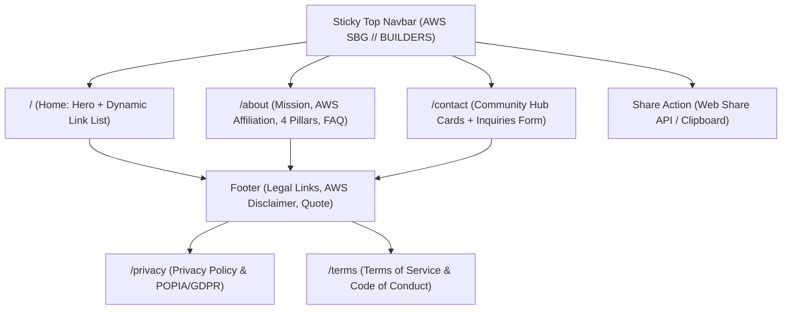

# AWS Student Builder Group (AWS SBG) — Public Hub PRD (`PRD_WEB.md`)

**Application:** Public Student Community Hub (`apps/web` → `https://awssbg.online`)  
**Design System:** Hardcore Neo-Brutalism  
**Target Audience:** Students, cloud learners, builders, university tech clubs, aspiring AWS certified architects  
**Status:** Approved Specification  

---

## 1. Brand Identity & Global Scope

- **Official Affiliation:** AWS Student Builder Group (AWS SBG) is an official student-led global community affiliated with, powered by, and supported by **Amazon Web Services (AWS)** across 60+ countries.
- **Brand Purpose:** Empowering students to build software on AWS, organize hands-on AWS Study Jams, earn certification vouchers (Cloud Practitioner & Solutions Architect), and connect with industry mentors.
- **Zero Trademark Infringement:** STRICTLY NEVER use the trademark word "Linktree" anywhere on the site, meta tags, headers, footers, copy, or UI. Refer to the platform solely as **AWS SBG site** or **AWS Student Builder Group**.
- **Data Protection Guarantee:** Personal data is strictly never sold, rented, or traded.

---

## 2. Hardcore Neo-Brutalist Design System

- **Geometry:** `0px` razor-sharp corners on all cards, buttons, badges, modals, inputs, and drawers (zero rounded corners).
- **Borders & Shadows:** `3px solid #000000` ink borders with `4px 4px 0px #000000` hard offset drop shadows (`shadow-[4px_4px_0px_#000000]`).
- **Color Palette:**
  - Canvas Background: `#F4F4F5` with subtle `24px x 24px` grid overlay (`brutal-grid-bg`).
  - Card & Container Fill: Pure White (`#FFFFFF`).
  - Ink & Primary Text: Pure Black (`#000000`).
  - Secondary / Muted Text: Deep Charcoal (`#3F3F46` / `#71717A`).
  - AWS Electric Purple: `#7C3AED` (Primary highlight & fill sweep).
  - AWS Cyber Blue: `#2563EB` (Secondary accent & tags).
  - Alert Yellow: `#FEF08A` (Notice badges).
- **Typography:**
  - Headings: `Montserrat` (Weights: 700, 800, 900, uppercase, tight tracking).
  - Body & UI: `Inter` (Weights: 400, 500, 600, 700).
  - Badges, Timestamps, Labels & Code: System Monospace (`ui-monospace`, uppercase, bold).
- **Icons:** STRICTLY monochrome/solid SVG icons via `react-icons` (`hi2`, `si`, `fa6`). ZERO emojis in UI elements.
- **Micro-interactions:**
  - Left-to-right fill sweep: `scaleX(0)` → `scaleX(1)` with color inversion on hover.
  - Tactile mechanical click: `active:translate-x-[2px] active:translate-y-[2px] active:shadow-none`.
  - Keyboard Focus Ring: `outline: 3px solid #000000; outline-offset: 3px;`.

---

## 3. Site Navigation & Page Architecture

---

## 4. Navigation Header (`Header.tsx`)

- **Placement:** Full-bleed sticky header (`sticky top-0 z-30`), `border-b-[3px] border-black bg-white`, with iOS safe-area top padding (`pt-[env(safe-area-inset-top)]`).
- **Header Contents:**
  1. **Brand Mark (Left):** 0px boxed AWS SBG logo stamp (`border-2 border-black bg-white shadow-[2px_2px_0px_#000000]`) + Monospace text `AWS SBG // BUILDERS`.
  2. **Desktop Navigation Links (Center):**
     - `Home` (`/`)
     - `About` (`/about`)
     - `Contact` (`/contact`)
     - Active link indicated by an inverted black pill badge with white text.
  3. **Actions (Right):**
     - **Share Button:** Triggers native `navigator.share` on mobile, or copies URL to clipboard with Sonner toast confirmation on desktop.
     - **Mobile Hamburger Button (Mobile only):** Slides out a Neo-Brutalist navigation drawer with 0px sharp borders.

---

## 5. Page Specifications

### A. Home Page (`/`) — Central Community Hub
- **Layout:** Centered column constrained to `max-w-[500px]`, horizontal padding `px-4 sm:px-5`.
- **Hero Section:**
  - Featured AWS SBG Stamp logo.
  - Eyebrow tag: `// AWS_STUDENT_BUILDER_GROUP`.
  - High-impact headline: `BUILD, CERTIFY & CONNECT IN THE CLOUD`.
  - Subtext: Student cloud builder community overview.
  - **4 Interactive Core Pillar Badges:**
    - `AWS Study Jams` (`HiOutlineBolt`, Purple accent)
    - `Cert Vouchers` (`HiOutlineAcademicCap`, Blue accent)
    - `Cloud Quest` (`HiOutlineCloud`, Purple accent)
    - `Cloud Projects` (`HiOutlineCube`, Blue accent)
- **Dynamic Link List:**
  - Fetched live from Supabase `links` table (`is_active = true`, ordered by `sort_order`).
  - Neo-Brutalist skeleton loader (4 animated cards) while fetching.
  - Telemetry: Triggers `increment_link_clicks` RPC upon clicking any link.
  - Left-to-right purple fill sweep on hover + directional arrow translation (`group-hover:translate-x-0.5 group-hover:-translate-y-0.5`).
  - Supports platforms: AWS, Skill Builder, Meetup, WhatsApp, Discord, LinkedIn, GitHub, YouTube, Instagram, X/Twitter, TikTok, Facebook, Telegram, Medium, Dev.to, Hashnode, Generic Website.

### B. About Page (`/about`) — Mission & Deep Dive
- **Layout:** Clean card layout constrained to `max-w-[680px]` with generous vertical padding.
- **Sections:**
  1. **Hero Intro Stamp:** `// ABOUT_US // GLOBAL_STUDENT_COMMUNITY`.
  2. **Official AWS Affiliation Notice:** Yellow brutalist highlight box explaining the student-led structure powered and supported by Amazon Web Services.
  3. **Mission Statement:** Preparing the next generation of cloud architects, developers, and AI builders.
  4. **The 4 Pillars in Detail:**
     - Hands-on AWS Study Jams (EC2, S3, Lambda, Bedrock, Serverless).
     - AWS Certification Bootcamps & Voucher distribution.
     - Cloud Quest & Gamified learning sprints.
     - Open-source and hackathon cloud projects.
  5. **Frequently Asked Questions (FAQ):**
     - Who can join? (All university students worldwide).
     - Are events free? (Yes, 100% free community sessions).
     - How do I get certification vouchers? (Participation in active Study Jams).
     - How do I start an SBG group on my campus?

### C. Contact & Inquiries Page (`/contact`)
- **Layout:** Constrained to `max-w-[680px]` with high-contrast form elements.
- **Direct Community Hub Channels:**
  - Discord Server card
  - WhatsApp Announcement Channel card
  - Official Community Email card
  - GitHub Organization card
  - LinkedIn Group card
- **Interactive Neo-Brutalist Inquiry Form:**
  - Fields:
    - **Full Name** (text input, required, `0px` border-2 border-black)
    - **Email Address** (email input, required)
    - **Inquiry Category** (Select dropdown: *General Inquiry*, *Join Study Jam*, *Host Workshop / Speaker Request*, *University Club Partnership*, *Other*)
    - **Message** (textarea, required)
  - Submission Workflow:
    - Submits payload to Supabase `inquiries` table with status `unread`.
    - Triggers Cloudflare Pages Function `/api/inquiries` which dispatches an email alert to `lethabomabilo33@gmail.com`.
    - Displays Sonner toast: `"Message sent! The AWS SBG team will get back to you shortly."`.
    - Resets form fields.

### D. Legal Pages (`/privacy` & `/terms`)
- **Privacy Policy (`/privacy`):**
  - Zero Data Sale guarantee.
  - POPIA & GDPR student privacy disclosure.
  - No trackers or advertising cookies used.
- **Terms of Service (`/terms`):**
  - Community Code of Conduct.
  - Amazon Web Services trademark acknowledgments.
  - Non-commercial student organization disclaimer.

---

## 6. Footer Section (`Footer.tsx`)

- Full-bleed `border-t-[3px] border-black bg-white py-6`.
- Content centered in `max-w-[500px]`:
  - Builder quote stamp: `"GO BUILD." — AWS STUDENT BUILDER GROUP`
  - Legal navigation: `Privacy Policy` • `Terms of Service`
  - Official AWS affiliation disclaimer.
  - Copyright: `© {current_year} AWS Student Builder Group`.

---

## 7. AI, SEO & Metadata Architecture

- **Context Files for AI Crawlers:**
  - `/llms.txt`: Plain text overview of AWS SBG, activities, core pillars, and verified URLs.
  - `/llms-full.txt`: Comprehensive plain text markdown index for AI agents (Claude, GPT, Perplexity).
- **Robots Directives (`robots.txt`):**
  - Explicit `Allow: /` for AI scrapers: `GPTBot`, `ClaudeBot`, `PerplexityBot`, `Amazonbot`, `Google-Extended`.
  - Strict `Disallow: /admin` and `Disallow: /admin/*`.
- **Structured Data (Schema.org JSON-LD):**
  - Embedded in `layout.tsx`: `EducationalOrganization` (declaring Amazon Web Services as `parentOrganization`), `WebSite`, and `FAQPage`.
- **OpenGraph & Twitter Cards:**
  - `summary_large_image` with high-contrast Neo-Brutalist logo stamp preview.
